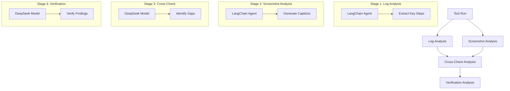

# Multi-Agent Vision-Log Analyzer

This tool demonstrates a sophisticated multi-agent system that combines vision analysis with log processing to verify test execution accuracy. Using a coordinated team of specialized agents - log analyzers, vision processors, and verification experts - it compares test execution logs with visual evidence (screenshots) to identify discrepancies between planned and actual test steps. The system leverages advanced language models and vision analysis to automatically detect missing steps, sequence issues, and verification gaps, providing detailed reports that help improve test coverage and reliability.

## Video Tutorials

1. [Part 1: Workflow and Multi-Agent System](https://www.loom.com/share/0803783ea9cd4a5899c0699c75c361a7?sid=c9b20281-e446-4bca-968c-0ab2d4f431bc)
   - Explains the workflow
   - Details of the multi-agent system
   - How to run the analysis

2. [Part 2: Running the Agent and Results](https://www.loom.com/share/84e48e740fea45b8908f955cf8463678?sid=b1081fc1-0fff-434c-9a17-56dfa72acfa4)
   - Running with existing screenshot analysis
   - Running without existing screenshot analysis
   - Understanding the results

## Why Screenshots Instead of Video?

The agent uses screenshots from test execution instead of video analysis for several reasons:
1. **Cost Efficiency**: Video analysis would require multiple API calls per second of video, making it prohibitively expensive
2. **Processing Speed**: Analyzing individual screenshots is much faster than processing video frames
3. **TestZeus Integration**: TestZeus already captures screenshots at key interaction points, providing a reliable source of visual evidence
4. **Focused Analysis**: Screenshots capture the exact moments of interaction, making it easier to verify specific steps

## Process Overview



## Analysis Stages

### 1. Log Analysis
- Uses a LangChain agent to analyze test execution logs
- Extracts key steps and planned actions
- Identifies critical verification points
- Outputs structured log analysis

### 2. Screenshot Analysis
- Uses a LangChain agent to analyze test execution screenshots
- Generates detailed captions for each screenshot
- Identifies UI elements and their states
- Captures notable interactions and changes

### 3. Cross-Check Analysis
- Uses DeepSeek model to compare log and screenshot analyses
- Identifies genuine gaps between planned and actual execution
- Categorizes findings into:
  - Missing Evidence
  - Sequence Issues
  - Verification Gaps

### 4. Verification Analysis
- Uses DeepSeek model to verify the cross-check findings
- Confirms or corrects each identified gap
- Provides evidence from screenshot data
- Generates final summary of actual gaps

## Setup

1. Install dependencies:
```bash
pip install -r requirements.txt
```

2. Create a `.env` file with your API keys:
```
OPENAI_API_KEY=your_openai_api_key_here
GROQ_API_KEY=your_groq_api_key_here
```

## Project Structure

- `main.py`: Main analysis pipeline implementation
- `analysis_agent_langchain/`: LangChain agent implementations
  - `agent.py`: Base agent implementation
  - `prompts.py`: Agent prompts and templates
  - `tools.py`: Custom tools for agents
    - `extract_steps_from_log`: Parses test execution logs
    - `analyze_screenshot`: Analyzes screenshots using GPT-4 Vision
    - `setup_tool_log_analyzer`: Configures log analysis tools
    - `setup_tool_video_analyzer`: Configures screenshot analysis tools
- `requirements.txt`: Project dependencies
- `.env`: Environment variables

## Usage

```python
from main import main

# Run analysis using existing screenshot analysis (faster)
test_name = "Search_for_a_product,_add_to_cart,_and_verify_cart_contents"
run_id = "run_20250607_134626"
main(test_name, run_id, use_existing_analysis=True)

# Run fresh analysis including screenshot analysis (slower as it creates screenshot captions)
main(test_name, run_id, use_existing_analysis=False)
```

## Output

The agent generates a comprehensive analysis report containing:
1. Log Analysis Results
   - Extracted key steps
   - Planned actions
   - Verification points

2. Screenshot Analysis Results
   - Detailed captions
   - UI element states
   - Interaction details

3. Cross-Check Results
   - Identified gaps
   - Sequence issues
   - Verification gaps

4. Verification Results
   - Confirmed findings
   - Corrected claims
   - Final summary

## Sample Output

Here's an example of the final analysis output (`final_analysis_{test_name}_{run_id}.json`):

```json
{
  "test_name": "Search_for_a_product,_add_to_cart,_and_verify_cart_contents",
  "run_id": "run_20250607_134626",
  "timestamp": "2025-06-10T13:21:03.319488",
  "verification_results": "VERIFICATION RESULTS:\n1. Confirmed Conclusions (with evidence):\n- Missing Login Process: The login steps (1-4) are not captured. The earliest screenshot is \"openurl_end_1749284213267076100.png\", showing the site navigation, but no login page or credentials entry.\n- Incomplete 'Add to Cart' Verification: Screenshot \"click_start_1749284317464755500.png\" shows the \"Remove\" button, implying the item was added, but lacks the 'Add to Cart' click and cart badge update.\n- Missing Cart Page Verification: No screenshot displays the detailed cart page; only the cart icon is shown.\n- Incomplete 'Remove from Cart' Process: The \"Remove\" button is present, but no screenshot shows the removal action or cart update to zero.\n- Verification Gaps: No screenshots show checks of the cart badge after actions.\n- Sequence Issues: Transition from product page to cart page is missing, disrupting the sequence.\n2. Incorrect Conclusions (with actual evidence):\n- None of the conclusions are incorrect as all are supported by the absence of specific screenshots.\n3. Final Summary:\n- Missing Login Process: Occurred between \"openurl_start_1749284212718549000.png\" and \"openurl_end_1749284213267076100.png\". Evidence before: Initial navigation; after: Product page without login.\n- 'Add to Cart' Step: Missing between product listing and cart icon. Evidence before: Product page; after: Cart icon with item.\n- Cart Page: Not shown between product page and end. Evidence before: Product page; after: Cart icon.\n- 'Remove from Cart' Action: Missing between cart icon and empty state. Evidence before: Cart icon with item; after: No item.\n- Verifications: Missing after each action. Evidence before: Action taken; after: No verification.\nAll conclusions are confirmed correct based on the provided screenshot data."
}
```

The verification results are structured into three main sections:
1. **Confirmed Conclusions**: Lists verified gaps and issues with specific screenshot evidence
2. **Incorrect Conclusions**: Identifies any false positives from the initial analysis
3. **Final Summary**: Provides a detailed breakdown of each missing step, including:
   - When it should have occurred (between which screenshots)
   - Evidence before and after the missing step
   - Any partial evidence of the step being attempted

## Analysis Logs

Analysis results are saved in `analysis_logs/` with the following files:

1. Screenshot Analysis:
   - `video_analysis_{test_name}_{run_id}.json`
   - Contains full screenshot analysis
   - Includes detailed captions and UI element states

2. Final Analysis:
   - `final_analysis_{test_name}_{run_id}.json`
   - Contains complete analysis results including:
     - Log analysis
     - Screenshot analysis
     - Cross-check results
     - Verification results
     - Timestamp of analysis
   - This is the most comprehensive log file with all stages of analysis

## Future Improvements

- Implement parallel screenshot analysis
- Add support for video analysis (when cost-effective)

