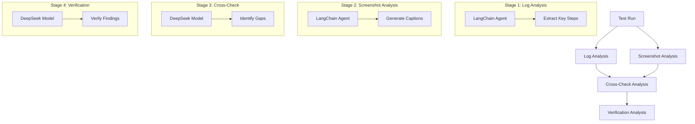

# Hercules Test Analysis Agent

This agent analyzes Hercules test runs by comparing planned steps with actual execution in video recordings. It uses a multi-stage analysis process to identify gaps between planned and actual test execution.

## Why Screenshots Instead of Video?

The agent uses screenshots from test execution instead of video analysis for several reasons:
1. **Cost Efficiency**: Video analysis would require multiple API calls per second of video, making it prohibitively expensive
2. **Processing Speed**: Analyzing individual screenshots is much faster than processing video frames
3. **TestZeus Integration**: TestZeus already captures screenshots at key interaction points, providing a reliable source of visual evidence
4. **Focused Analysis**: Screenshots capture the exact moments of interaction, making it easier to verify specific steps

## Process Overview



## Analysis Stages

### 1. Log Analysis
- Uses a LangChain agent to analyze test execution logs
- Extracts key steps and planned actions
- Identifies critical verification points
- Outputs structured log analysis

### 2. Screenshot Analysis
- Uses a LangChain agent to analyze test execution screenshots
- Generates detailed captions for each screenshot
- Identifies UI elements and their states
- Captures notable interactions and changes

### 3. Cross-Check Analysis
- Uses DeepSeek model to compare log and screenshot analyses
- Identifies genuine gaps between planned and actual execution
- Categorizes findings into:
  - Missing Evidence
  - Sequence Issues
  - Verification Gaps

### 4. Verification Analysis
- Uses DeepSeek model to verify the cross-check findings
- Confirms or corrects each identified gap
- Provides evidence from screenshot data
- Generates final summary of actual gaps

## Setup

1. Install dependencies:
```bash
pip install -r requirements.txt
```

2. Create a `.env` file with your API keys:
```
OPENAI_API_KEY=your_openai_api_key_here
GROQ_API_KEY=your_groq_api_key_here
```

## Project Structure

- `main.py`: Main analysis pipeline implementation
- `analysis_agent_langchain/`: LangChain agent implementations
  - `agent.py`: Base agent implementation
  - `prompts.py`: Agent prompts and templates
  - `tools.py`: Custom tools for agents
    - `extract_steps_from_log`: Parses test execution logs
    - `analyze_screenshot`: Analyzes screenshots using GPT-4 Vision
    - `setup_tool_log_analyzer`: Configures log analysis tools
    - `setup_tool_video_analyzer`: Configures screenshot analysis tools
- `requirements.txt`: Project dependencies
- `.env`: Environment variables

## Usage

```python
from main import main

# Run analysis using existing screenshot analysis
main(use_existing_analysis=True)

# Run fresh analysis including screenshot analysis
main(use_existing_analysis=False)
```

## Output

The agent generates a comprehensive analysis report containing:
1. Log Analysis Results
   - Extracted key steps
   - Planned actions
   - Verification points

2. Screenshot Analysis Results
   - Detailed captions
   - UI element states
   - Interaction details

3. Cross-Check Results
   - Identified gaps
   - Sequence issues
   - Verification gaps

4. Verification Results
   - Confirmed findings
   - Corrected claims
   - Final summary

## Analysis Logs

Analysis results are saved in `analysis_agent/analysis_logs/` with timestamps:
- `video_analysis_{test_name}_{timestamp}.json`
- Contains full screenshot analysis
- Includes cross-check and verification results

## TODO

- Add more detailed error handling
- Implement parallel screenshot analysis
- Add support for video analysis (when cost-effective)
- Add unit tests
- Add integration tests

